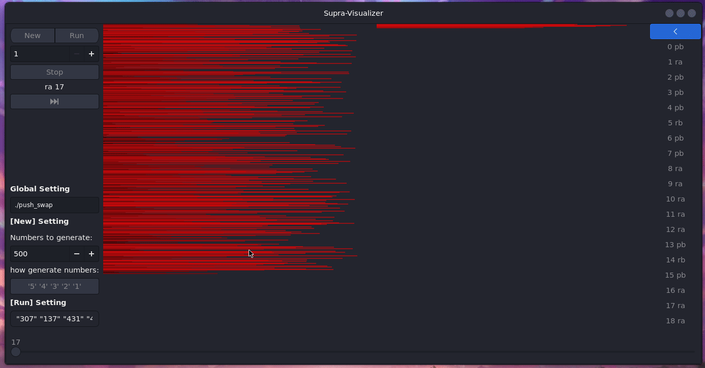

# Visualizateur 

visualise la stack A et B pour push_swap de 42



```valac main.vala function.vala --pkg=posix --pkg=gtk+-3.0 -X -O3```

ou

```make```

## Utilisation

mettre le push_swap a coté de l'executable
et faire :

```./visualizer xxx```

xxx représente la stack que le programme generera.
